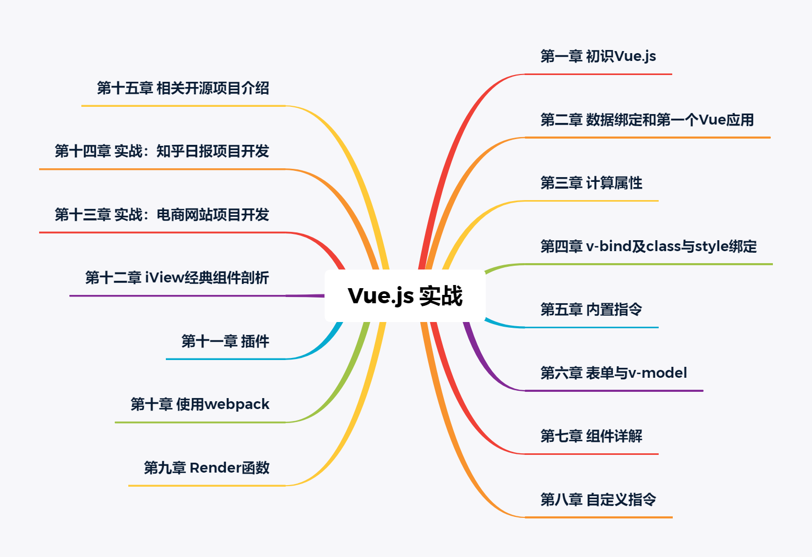

# Vue.js 实战 读书笔记

## [第一章 初识Vue.js](01初识Vue.js/README.md)

## [第二章 数据绑定和第一个Vue应用](02数据绑定和第一个Vue应用/README.md)

## [第三章 计算属性](03计算属性/README.md)

## [第四章 v-bind及class与style绑定](04v-bind及class与style绑定/README.md)

## [第五章 内置指令](05内置指令/README.md)

## [第六章 表单与v-model](06表单与v-model/README.md)

## [第七章 组件详解](07组件详解/README.md)

## [第八章 自定义指令](08自定义指令/README.md)

## [第九章 Render函数](09Render函数/README.md)

## [第十章 使用webpack](10使用webpack/README.md)

## [第十一章 插件](11插件/README.md)

## [第十二章 iView经典组件剖析](12iView经典组件剖析/README.md)

## [第十三章 实战：电商网站项目开发](13实战：电商网站项目开发/README.md)

## [第十四章 实战：知乎日报项目开发](14实战：知乎日报项目开发/README.md)

## [第十五章 相关开源项目介绍](15相关开源项目介绍/README.md)

## [示例代码](https://github.com/icarusion/vue-book.git)